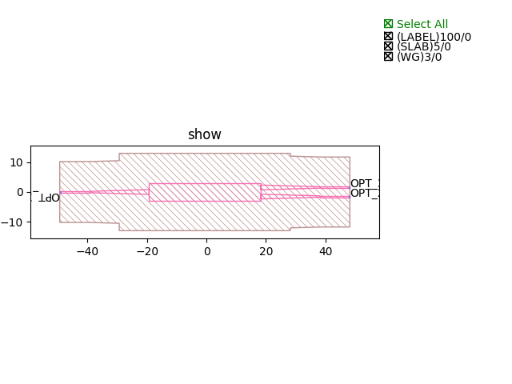
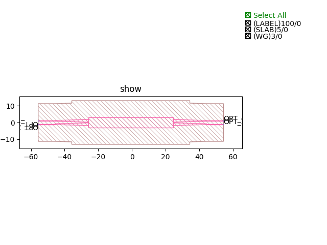

MultiMode Interferometers (MMI)
####################################

SOI500nm_1550nm_TE_RIB_2x1_MMI
**************************************************

+------------------------------+-----------------------------+-------------+
|          ports               |     waveguide type          | orientation |
+==============================+=============================+=============+
|OPT1                          |   TECH.WG.SOI_RIB.C.WIRE    |     180     |
+------------------------------+-----------------------------+-------------+
|OPT2                          |   TECH.WG.SOI_RIB.C.WIRE    |       0     |
+------------------------------+-----------------------------+-------------+
|OPT3                          |   TECH.WG.SOI_RIB.C.WIRE    |       0     |
+------------------------------+-----------------------------+-------------+

SOI500nm_1550nm_TE_RIB_2x2_MMI
***************************************************

+----------------------------------+-----------------------------+-------------+
|              ports               |     waveguide type          | orientation |
+==================================+=============================+=============+
|OPT_1                             |   TECH.WG.SOI_RIB.C.WIRE    |     180     |
+----------------------------------+-----------------------------+-------------+
|OPT_2                             |   TECH.WG.SOI_RIB.C.WIRE    |     180     |
+----------------------------------+-----------------------------+-------------+
|OPT_3                             |   TECH.WG.SOI_RIB.C.WIRE    |     0       |
+----------------------------------+-----------------------------+-------------+
|OPT_4                             |   TECH.WG.SOI_RIB.C.WIRE    |     0       |
+----------------------------------+-----------------------------+-------------+
